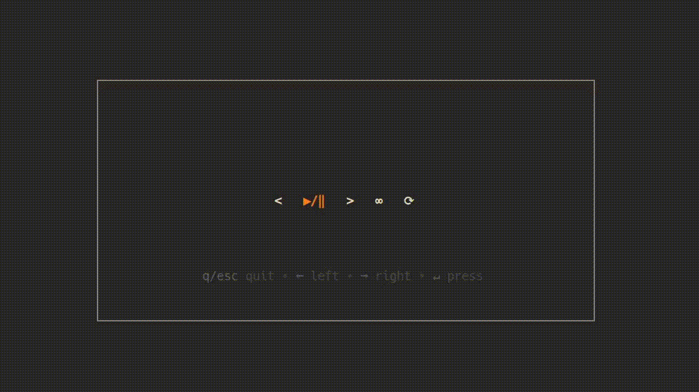

# Spotify TUI App

This app provides basic functionalities like resume/pause, skip to previous/next, toggle shuffle and resume, i.e, track, context and disable it.

User's authorization is handled via PKCE Flow.

## Payer Interface



## Config Sample

```json
{
  "client_id": "<required>",
  "refresh_token": "<handled by the app>"
}
```

